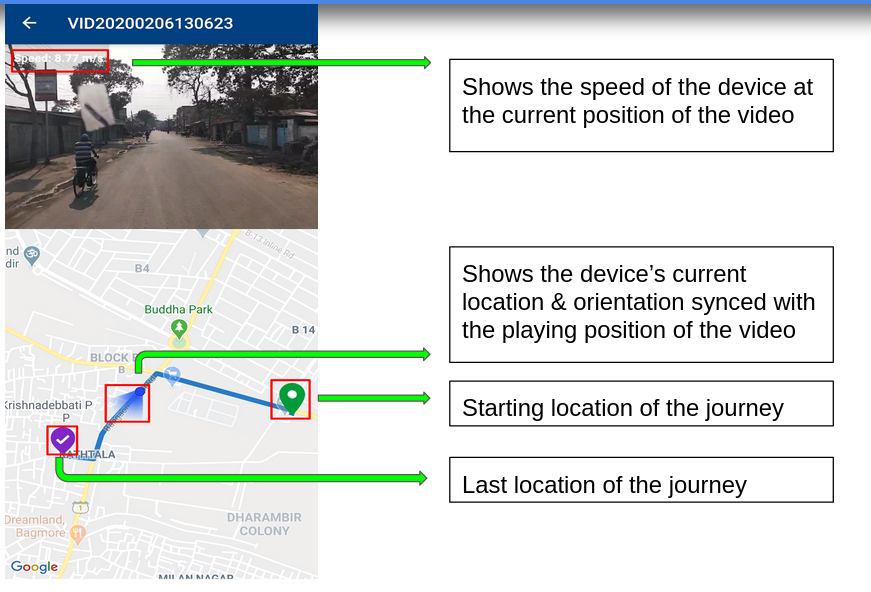

# Geo Tagged Video (Geocam)
*Application to record and play geo-tagged videos*

## Idea Description
### Recording and Saving Geolocation
* **Fetch data**(location, orientation, speed) using GPS and compass while recording the video
* **Pre-process**(arrange and even encrypt if the user wishes) the data obtained upon stopping the recording
* Writing location information into the video. It involves injecting data directly into the metadata of the video, using ffmpeg library, which deletes the requirement of having a companion file, making the information secure and video independently shareable

### Extracting and plotting geolocation
* Extraction of required meta-tag using ffmpeg when video is tapped to be played
* Parsing the extracted data to retrieve required information and feeding the information to the interactive map
* The map contains the start and the end locations of the journey in the video and a blue track shows the path followed throughout the journey while a marker moves along the blue track based on playing position of the video.

## Technology Stack
* **Flutter**                -For Building Android application
* **Inbuilt-Compass**        -For Device orientation
* **GPS**                    -For getting device’s location continuously
* **FFMPEG**    
  * For writing location and other information into the video
  * For extracting location and other info like speed, timestamp from the video
* **Google-direction API**
  * For drawing blue-colored route between the start and end point.
## Use Cases
* Getting location-specific information.
* Can be used to give better insights of a location in crime investigations.
* Travellers can get better idea of their next travel destination and can even share it.
* Can be used to tour a place/area with already available geotagged-videos.
* Better categorization of videos based on location
* Can be used by companies to target specific location-based audiences

## Overview

